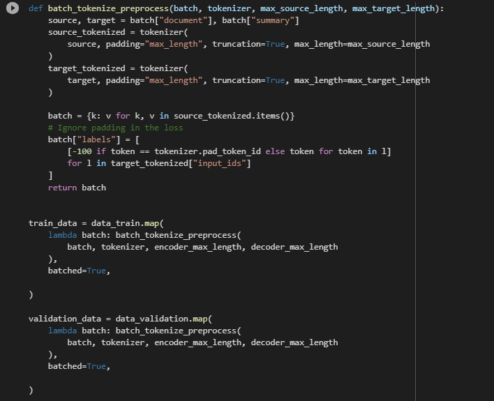
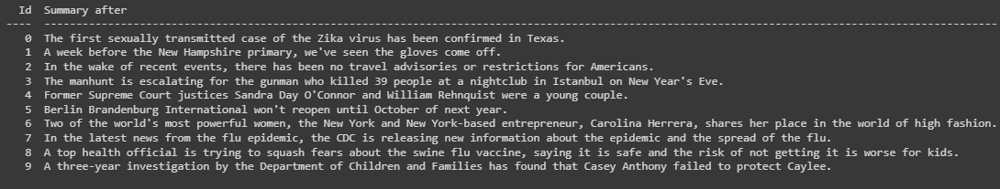
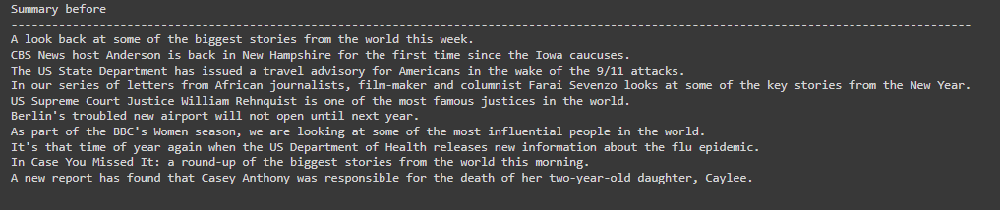
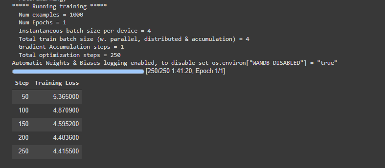

# SynthUse

### Datasets and models used:

#### BART FINE TUNING

<ul>
  
  
  <li>Mediasum Dataset from huggingface.("ccdv/mediasum")</li>
  
  <li>BART model used from hugging face.( model_name = "sshleifer/distilbart-xsum-12-3")</li>

  <li>Tokenization process:</li>
  
</ul>

<ul>
  
  <li>Results before fine tuning</li>
  
</ul>

<ul>
  <li> Results after fine tuning</li>
  
</ul>

  

<ul>
  
  <li> Dataset size : 
    <ol>
      <li>Train= 5000 datapoints</li>
      <li>Validation =22 datapoints</li>
      <li>Test =22 datapoints</li>
    </ol>
  </li>
  
  <li> Training Parameteres :
 </ul>
 <ul>
    <ol>
      <li>Batch Size=4</li>
      <li>No of Epochs=1</li>
      <li>Weight Deacy=0.1</li>
      <li> label_smoothing_factor=0.1</li>
    </ol>
  </li>
  
</ul> 
<ul>
  <li> A snapshot from the training preiod.</li>
  
</ul>
  

